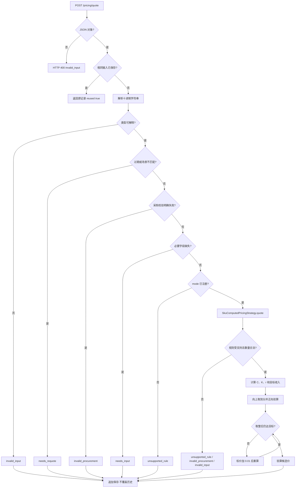

# SKU 定价请求流程

已实现路径。通用正向模式在图中标为未注册，不会并入简化公式。

```mermaid
flowchart TD
    A[POST /pricing/quote] --> B{JSON 对象?}
    B -->|否| Z[HTTP 400 invalid_input]
    B -->|是| C{相同输入已保存?}
    C -->|是| R[返回原记录 reused true]
    C -->|否| D[解析十进制字符串]
    D --> E{类型可解释?}
    E -->|否| S1[invalid_input]
    E -->|是| F{过期或场景不匹配?}
    F -->|是| S2[needs_requote]
    F -->|否| G{采购校验明确失败?}
    G -->|是| S3[invalid_procurement]
    G -->|否| H{必要字段缺失?}
    H -->|是| S4[needs_input]
    H -->|否| I{mode 已注册?}
    I -->|否| S5[unsupported_rule]
    I -->|是| J[SkuComputedPricingStrategy.quote]
    J --> K{规则受支持且数量合法?}
    K -->|否| S6[unsupported_rule / invalid_procurement / invalid_input]
    K -->|是| L[计算 C、K、r 和目标收入]
    L --> M[向上取到分并正向验算]
    M --> N{取整后仍达目标?}
    N -->|否| O[标价加 0.01 后重算]
    O --> N
    N -->|是| P[验算候选价]
    P --> Q[追加保存 不覆盖历史]
    S1 --> Q
    S2 --> Q
    S3 --> Q
    S4 --> Q
    S5 --> Q
    S6 --> Q
```

发布授权不在此流程中改变。服务始终返回 `publish_authorized: false`。
