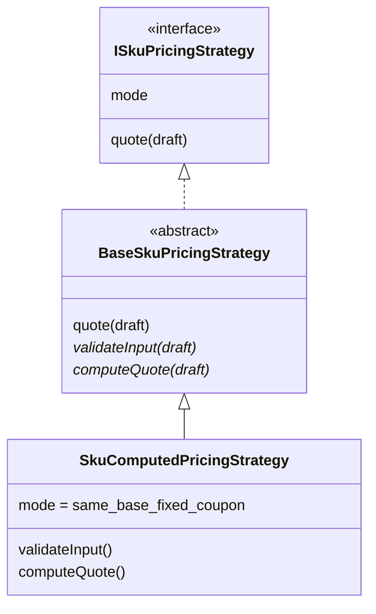

# 定价策略继承

```mermaid
classDiagram
    class ISkuPricingStrategy {
        <<interface>>
        mode
        quote(draft)
    }
    class BaseSkuPricingStrategy {
        <<abstract>>
        quote(draft)
        validateInput(draft)*
        computeQuote(draft)*
    }
    class SkuComputedPricingStrategy {
        mode = same_base_fixed_coupon
        validateInput()
        computeQuote()
    }
    ISkuPricingStrategy <|.. BaseSkuPricingStrategy
    BaseSkuPricingStrategy <|-- SkuComputedPricingStrategy
```

`quote` 只在基类实现。子类不能覆盖它。替换策略应另写一个子类，而不是继承 `SkuComputedPricingStrategy`。
